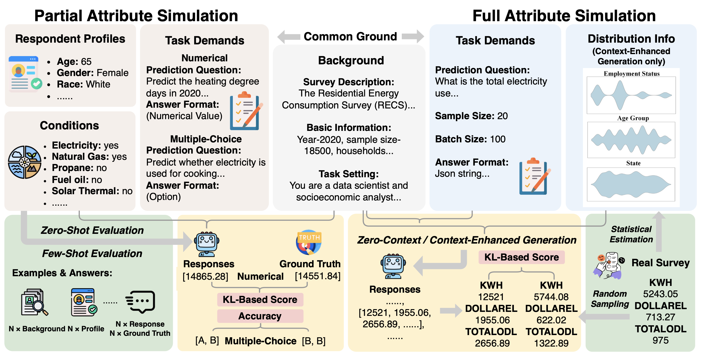
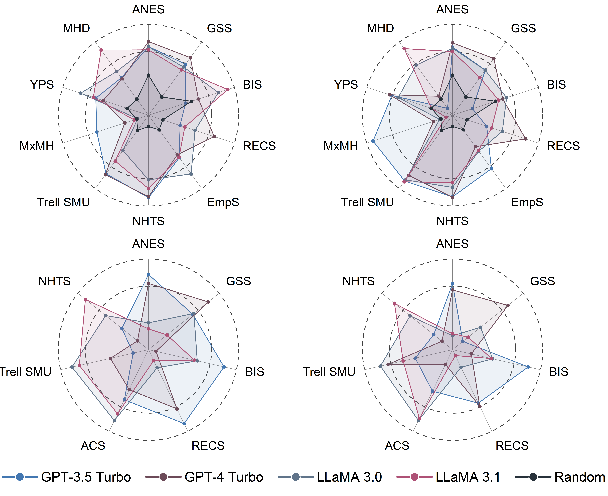
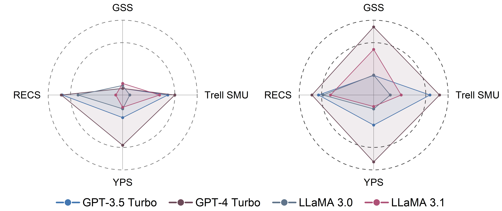

# LLM-S³: Large Language Model-based Sociodemographic Survey Simulation

This repository is the official implementation of [Large Language Models as Virtual Survey Respondents: Evaluating Sociodemographic Response Generation](https://openreview.net/forum?id=EOsmNflsGz). 

>📋  This paper presents **LLM-S³** (**L**arge **L**anguage **M**odel-based **S**ociodemographic **S**urvey **S**imulation), a novel benchmark designed to simulate survey respondents using large language models. It enables the generation of synthetic responses that closely mirror real-world sociodemographic patterns.

## 🔍 Key Contributions

- **New Simulation Paradigms**  
  Defines two tasks—**Partial Attribute Simulation (PAS)** for predicting missing demographic attributes, and **Full Attribute Simulation (FAS)** for generating complete response profiles.

- **Cross-Domain Benchmark**  
  Provides a standardized multi-domain benchmark—**LLM-S³**—based on eleven public datasets spanning four domains:  
  *Social and Public Affairs*, *Work and Income*, *Household and Behavioral Patterns*, and *Health and Lifestyle*.

- **Comprehensive Evaluation**  
  Benchmarks four LLMs (*GPT-4 Turbo*, *GPT-3.5 Turbo*, *LLaMA-3.0-8B*, and *LLaMA-3.1-8B*) using real survey data and quantitative evaluation metrics.

An overview of our benchmark workflow is illustrated in the following figure, showcasing Partial Attribute Simulation (left) and Full Attribute Simulation (right). 


## Requirements

### Install Ollama
To install the Ollama platform, execute the following command:

```bash
curl -fsSL https://ollama.com/install.sh | sh
```

### Install Dependencies
Create and activate a new conda environment with all required dependencies:

```bash
# Create environment from environment.yml
conda env create -f environment.yml -n myenv

# Activate the environment
conda activate myenv
```

After installation, you can run different versions of Llama models using the following commands:

```bash
# For Llama 3.0 8B
ollama run llama3

# For Llama 3.1 8B
ollama run llama3.1:8b
```


### Configure OpenAI API Key
Create a configuration file for your OpenAI API key:

```bash
echo "YOUR_API_KEY_HERE" > config/api_key.txt
```


## Project Guide

### 1. Locate the specified file path

Taking the prediction attribute of the public's support for presidential candidates in the ANES dataset as an example, first enter the following command to locate the file location: 

```bash
# ANES dataset
cd YOUR_DOCUMENTS/LLM-S-Cube-Benchmark/PAS/ANES
```

This code includes the use of large models llama3:8b and llama3.1:8b. Make sure you have deployed them locally. If not, you may use the command mentioned in Requirements.

### 2. Run the code and view the results (for PAS)

Before you run the code, you may need to change some path addresses in the code. For example, modify the mappings.json file in line 56 of the code to the address where you actually store it.

```bash
# Substitute to your actual address
line 55 def base_info(row):
line 56    mapping = load_mapping('./Anes2020/mappings/mapping.json')  
```

In addition, in lines 139, 191, and 242, replace the output address of the file (predicted and true values ​​in csv format) with your actual address.
After this, you can run the code with the following command:

```bash
# run election intention of ANES2020
python prompt_a20.py(PAS)
```

### 3. Run the code and view the results (for FAS)

Still taking the simulation of the public election intention of the ANES2020 dataset as an example. In FAS, each data point includes three simulated variables, which represent the voting intention values ​​of the three presidential candidates (ranging from 0-100) in a list format:

```bash
1. How would you rate Donald Trump? [0,100]
2. How would you rate Barack Obama? [0,100]
3. How would you rate Joe Biden? [0,100]
A sample list: ['80', '75', '65']
```

First enter the following command to locate the file location: 

```bash
# ANES dataset
cd YOUR_DOCUMENTS/LLM-S-Cube-Benchmark/FAS/ANES
```

After this, you can run the code with the following command:

```bash
# run election intention of ANES2020(FAS)
python Fsimulation.py
```

The generated simulation is saved in a txt file. Since the large model cannot fully standardize the output format to JSON in this experiment, we manually extracted a list of data that meets the format requirements to make the data we need fully conform to the above format.

After that, run the data processing file and save the output results and the real values ​​into a csv file. The real value selection data set has been randomly shuffled to reflect the real election opinions.

```bash
# run election intention of ANES2020(FAS)
python Fsimulation_deal.py
```

The resulting file should contain six columns: three columns for the actual value and three columns for the predicted value.

### 3. Calculate output (for FAS & PAS)
For the output results of the correct rate of multiple-choice questions, directly run the `.py` file to get the correct rate output results and store them in `acc.txt`. 

For the output of numerical values (non-selective question accuracy), you need to first calculate the KL divergence between the predicted value and the actual value. The data in our table is obtained by changing the KL divergence to the following formula (see the appendix of the article):

The **Kullback-Leibler (KL) divergence** calculation formula is as follows:

$$
D_{KL}(P \| Q) = \sum_{i=1}^K P_i \log \frac{P_i}{Q_i}
$$

Then, map the KL divergence $D_j$ for each target attribute to a [0, 1] score, where higher means better model performance:

$$
S_j = \frac{ \ln\left(1 + \frac{1}{D_j}\right) }{ 1 + \ln\left(1 + \frac{1}{D_j}\right) }
$$

- **Higher $S_j$:** Better alignment between predicted and true distributions  
- **Lower $S_j$:** Larger divergence between predicted and true


### 4. Model Performance Visualization

We use radar plots to provide an intuitive comparison of model performance across datasets, prediction tasks, and evaluation settings in both the PAS and FAS scenarios.

- #### For PAS: 


- **Plot design:**  
  Each axis is individually scaled within its dataset for better visualization of relative differences.
- **Prediction tasks:**  
  - **Multi-choice (top row):** Tasks with several answer options, performance measured by accuracy.
  - **Numerical (bottom row):** Continuous value estimation, performance measured by a normalized transformation of KL divergence.
- **Evaluation strategies:**  
  - **Zero-shot:** Shown on the left.
  - **Few-shot:** Shown on the right.

---   
- #### For FAS: 


- **Prediction tasks:**  
   Generate some batches of data based on background information to reflect the distribution, performance measured by a normalized transformation of KL divergence.

- **Evaluation strategies:**  
  - **Zero-context:** Shown on the left.
  - **Context-enhanced:** Shown on the right.


- **Scoring:**  
  Higher values always indicate better model performance.


